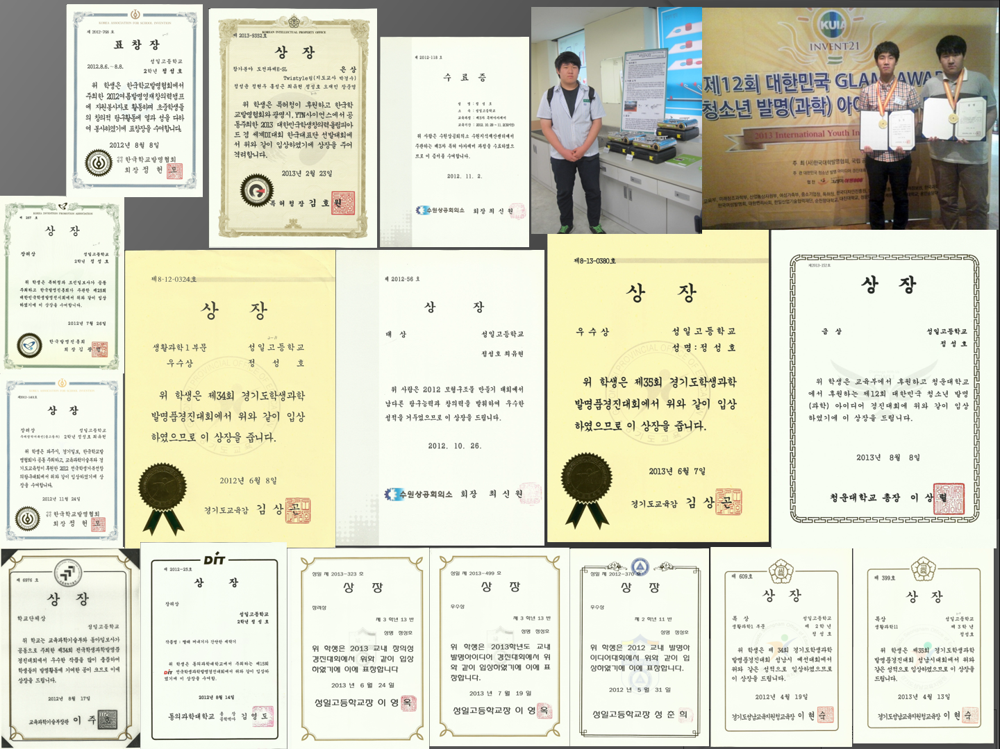
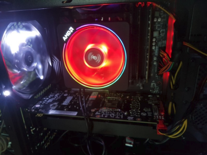
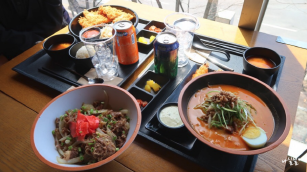

이력서
========
> 이름 : **정성호**
> 학교 : 한림대학교
> 학과 : 소트웨어융합대학
----------------------------------
#### 수강과목
1.오픈소스리눅스
----------------
추천 사이트 

[IT이야기 블로그]https://blog.naver.com/tjdgh25456)

자기 소개서 : 저는 고등학교때부터 발명을 하면서 많은 수상을 하였고 저의 장점을 찾게 되었습니다.
             대부분의 발명품은 IT기반의 발명품과 기계공학적인 발명품을 기안하고 설계도 설명서를
             작성하면서 간단한 발명적 사고와 창의적사고를 기르게 되었습니다. 그러면서 한림대학교에 
             입학을 하게되었고 IT분야와 컴퓨터하드웨어에 많은 흥미를 느끼게되면서 IT사업의 전체적인
             상황과 각기업의 제품을 주과적인 눈으로 보는것이 아니라 객과적으로보면 각 년도에 따라 
             이 제품이 왜 만이 팔리는지를 분석하게 되었습니다. 또한 컴퓨터 분야에도 상당한 관심이 
             있어서 조립대행을 해주면서 freelancer로 아주 작게 활동을 하였습니다. 또한 현재 IT분야를
             좋아하하는것보다 더 나아가 주위사람들과 그이외의 사람들에게도 자문을 받게되어 현재도 
             각 IT제품의 시장 상황을 알아보면 어느제품이 매력적인지 판단하고 추천하여 자문을 해주고 
             있습니다. 하지만 저도 완벽한 전문가가 아니라서 항상 공부하고 알아보고 노력하고
             있고 더욱 나아가서는 IT기업의 consultan,CTO,CEO,개발자등이 되는것이 저의 최종목표입니다.
             현재저의 주언어는:C,JAVA,SQL 입니다. 아직1학년이다 보니 처음 배워서 실력은 미숙하지만 
             점차 공부하여 실력을 늘려갈 생각입니다.

(컴퓨터사진은 인터넷에서 가지고 왔습니다.)

취미,특기 : 저의 취미는 요리입니다. 그래서 학교휴학동안 라멘집에서 일을 하면서 그냥 일만하는것이 
            아니라 매장을 관리하는 점장직책을 맡아 매장에서 전체적인 음식관리와 직원교육관리들을
            하였습니다. 밑의 사진은 제가 일할때 제가 만든음식을 손님이 블로그에 올린 사진입니다.
            또한 저의 특기는 드럼,기타연주입니다. 어렸을때 피아노를 배워서 기초적인 음악이론을 배워서
            악기에도 흥미가 많아 배우기 쉬워 악기를 빠르게 배우는것 같습니다. 어려운 연주가 아니고
            간단한 연주는 가능한 실력입니다.
 

